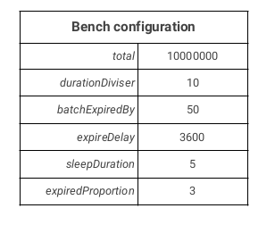
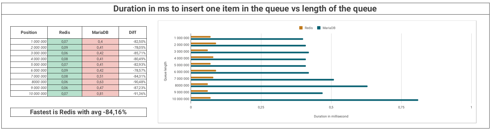
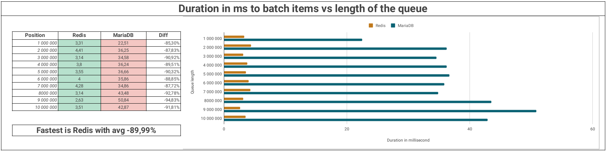
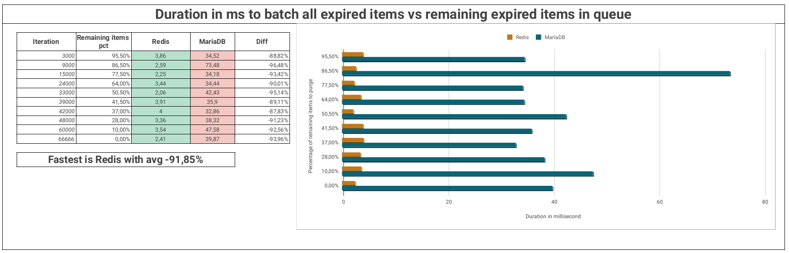

# Expiration Queue Management benchmark

This benchmark aim to test the performance of **Redis 7.0** vs **MariaDB 10.10** executing the tasks to manage and maintain a large dataset of items associated with a validity timestamp.

The main specification is defined using the Bench interface providing the mandatory methods corresponding to the expected benchmark algorithm.

Expected features :

- :rocket: Queue length must be equal to 10 000 000 items
- :mag: Each item must be selectable and updatable using a unique text identifier
- :hammer: It must be possible to select expired items in batch of N items
- :floppy_disk: Each item must have associated metadata used to help expired item handling (ex : reindaxion priority management using business rules) stored as string


The `Bench->cleanup()` and `Bench->getDatasetSizeInMegabytes()` methods are dedicated to the benchmark report and replay features.

## MariaDB overview

Associated code : [BenchMariaDB.php](bench/src/BenchMariaDB.php)

MariaDB benchmark use a SQL table with the following 3 columns :

```sql
CREATE TABLE `indexer` (
  `identifier` varchar(50) NOT NULL,
  `expiration_timestamp` int(11) NOT NULL,
  `metadata` varchar(50) NOT NULL DEFAULT '',
  PRIMARY KEY (`identifier`),
  KEY `indexer_expiration_timestamp` (`expiration_timestamp` ASC)
) ENGINE=InnoDB DEFAULT CHARSET=utf8mb4 COLLATE=utf8mb4_unicode_ci
```

Basic algorithm :

`BenchMariaDB->addItem()`
  - `INSERT INTO` the indexer table

`BenchMariaDB->batchExpired()`
  - fetch N items with timestamp < now (SELECT using `expiration_timestamp` index )
  - fetch and iterate over the items
  - update each item's timestamp and metadata one by one (update using PK `identifier`)


## Redis overview

Associated code : [BenchRedis.php](bench/src/BenchRedis.php)

Redis implementation use a combination of a Sorted Set (collection of unique members ordered by an associated score) to manage the timestamps
and a key value pair to store each item metadata.

`BenchRedis->addItem()`
  - add item to the sorted set using `zAdd` and timestamp as score
  - add item metadata to the associated key generated using `identifier`

`BenchRedis->batchExpired()`
  - fetch N items with timestamp < now (using `zRangeByScore`)
  - fetch and iterate over the items
      - grab each item metadata using `get`
      - update each item's timestamp one by one using `zAdd` and timestamp as score
      - update each item's metadata one by one using `set`


## Results

You can download the following report data : 

- MariaDB ([report](results/10000000/mariadb.json) / [log](results/10000000/mariadb.log))
- Redis ([report](results/10000000/redis.json) / [log](results/10000000/redis.log))

The following pictures are available in the [full PDF report](results/10000000/report.pdf)




